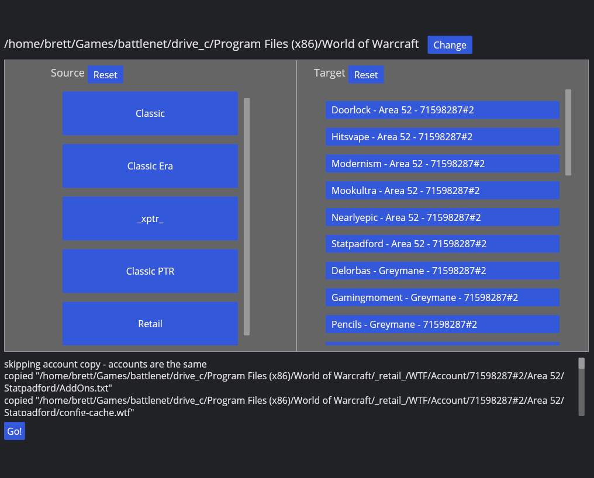

# wow-profile-copy-ng

Now with more buttons!



This is a complete rewrite (in rust, of course) of wow-profile-copy. The explicit goal was to add a graphical user interface to the application, rather than the TUI of the original.

TUIs are functional, but they're not intuitive or pretty. And well, this isn't pretty right now but I think it'll be more intuitive for the average WoW player.

## Why use this?

It's PTR week. Your guild wants to run the raid. You don't want to mess with setting up your weakauras, raid frames, and keybinds. 

Half a dozen clicks, and everything should be right where you expect it.

## Backups

This software overwrites large amounts of configuration data automatically. There is no "undo". For that reason, before you copy profiles around, you should consider taking a backup.

To do that, simply copy the entire `WTF` folder in the version folder that you're going to be copying to (e.g. `_classic_ptr_`) to somewhere safe before running the tool.

# FAQ

## My keybinds aren't copying correctly!

Disable keybind synchronization.

Log into the game version that configs are being copied to.

Type this in the chat window:
```
/console synchronizeBindings 0
```

Close the game, Re-run the sync.

Open the game, and run:
```
/console synchronizeBindings 1
```
In the chat window.

Change *any* key binding, and apply the changes - you can change it back later.

This "tricks" the WoW client into accepting the new keybindings, and saving them to Blizzard's servers. Otherwise, it sees that the keybindings for the account don't match the ones saved on the server, and "helpfully" changes them.

Leaving `synchronizeBindings` turned off entirely also solves the issue.

## How do I copy the spell placements on my hotbars?

As far as I can tell, spell -> bar slot assignments are saved to the realm. That means there's no way for this tool to copy them, because the data doesn't exist on your computer. However, something like [MySlot](https://github.com/tg123/myslot) can help with that.
